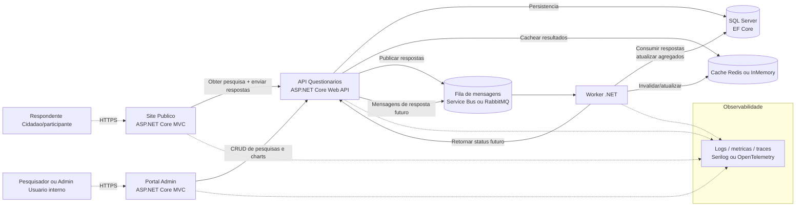
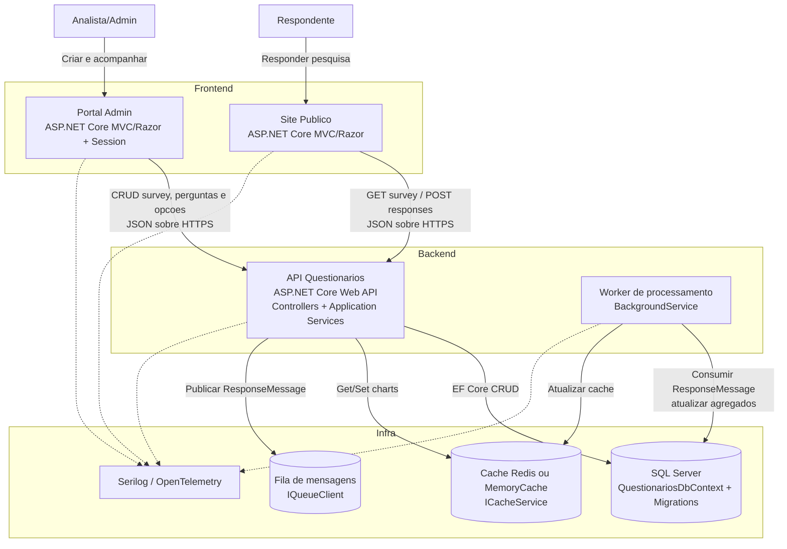
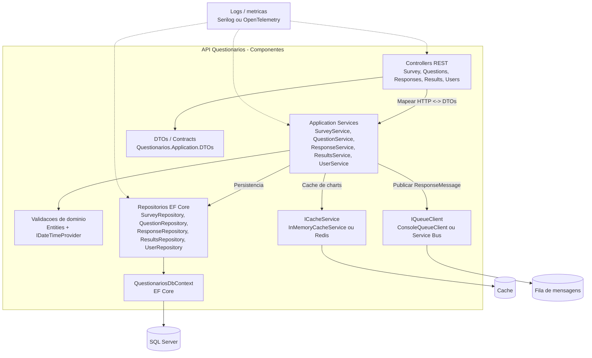
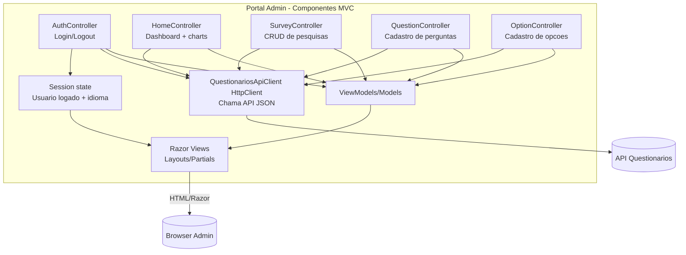
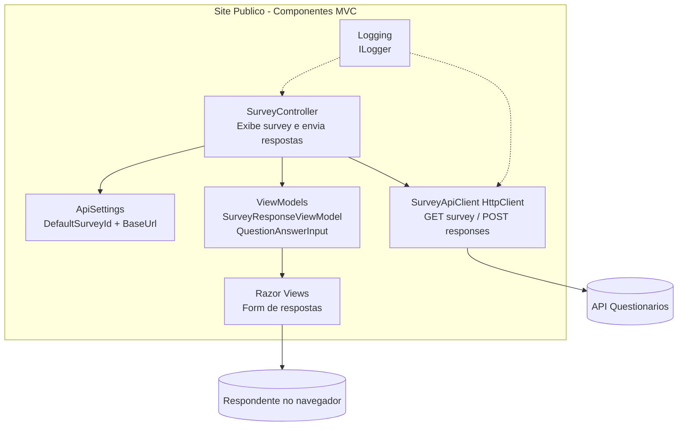
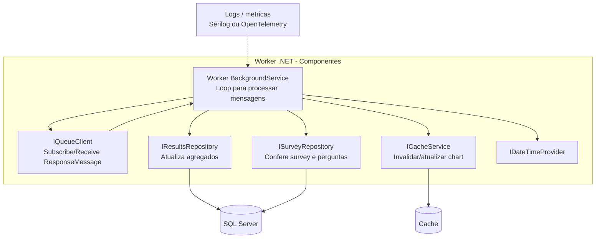

# Modelo C4 do Questionarios

Diagramas Mermaid para o documento tecnico funcional. O codigo fonte de cada diagrama esta nos arquivos `doc/*.mmd` para facilitar edicao e renderizacao.

## Como visualizar
- Abra os `.mmd` em um editor com suporte a Mermaid (ex.: VS Code) ou cole o bloco abaixo no [mermaid.live](https://mermaid.live).
- Mantenha os arquivos `.mmd` como fonte da verdade; este markdown replica o conteudo para leitura rapida.

## C1 - Contexto (quem usa o que)
Fonte: `doc/c4-context.mmd`

Notas: dois atores principais (respondente e analista/admin) acessam front-ends MVC distintos, ambos dependentes da API. A API centraliza persistencia (SQL Server via EF Core), cache de resultados e publicacao de mensagens para processamento assincrono no worker.

## C2 - Container (responsabilidades por deployable)
Fonte: `doc/c4-container.mmd`

Notas: quatro containers .NET (2 MVC, 1 Web API, 1 Worker) comunicam-se via HTTP/JSON e fila. Redis/InMemory e fila sao abstraidos por interfaces. SQL Server e EF Core concentram dados transacionais e agregados.

## C3 - Componentes

### API Questionarios
Fonte: `doc/c4-component-api.mmd`

Notas: controllers convertem HTTP/DTOs e delegam para application services. Services usam repositorios EF Core, cache para charts e fila para respostas. `IDateTimeProvider` facilita testes de regras de tempo. Queue/Cache possuem implementacoes stub que podem ser trocadas.

### Portal Admin (MVC)
Fonte: `doc/c4-component-portal.mmd`

Notas: controllers MVC usam `QuestionariosApiClient` (HttpClient configurado via `ApiOptions`) para chamar a API. Sessao armazena usuario/idioma apos login. Views Razor renderizam os ViewModels. Autenticacao/autorizar ainda e simplificada (sem tokens).

### Site Publico (MVC)
Fonte: `doc/c4-component-webpublico.mmd`

Notas: o controller obtem o survey default das `ApiSettings`, monta ViewModel, valida respostas e publica via API. Logger captura falhas de chamada HTTP para alertar operador.

### Worker (.NET Background Service)
Fonte: `doc/c4-component-worker.mmd`

Notas: o worker projetado consome `ResponseMessage` da fila para atualizar agregados e cache. Hoje o projeto traz apenas o esqueleto do `Worker`, entao o consumo real e uma pendencia tecnica.

## Pendencias e proximos passos
- Implementar de fato o consumidor de fila no worker (assinar `IQueueClient`, atualizar agregados e invalidar cache).
- Substituir stubs de cache/fila por Redis/Service Bus reais e incluir health checks.
- Endurecer autenticacao/autorizacao no Portal Admin e eventualmente nos endpoints da API.
- Expandir observabilidade (correlacao de request IDs, traces distribuidos e alertas de latencia/erros).
