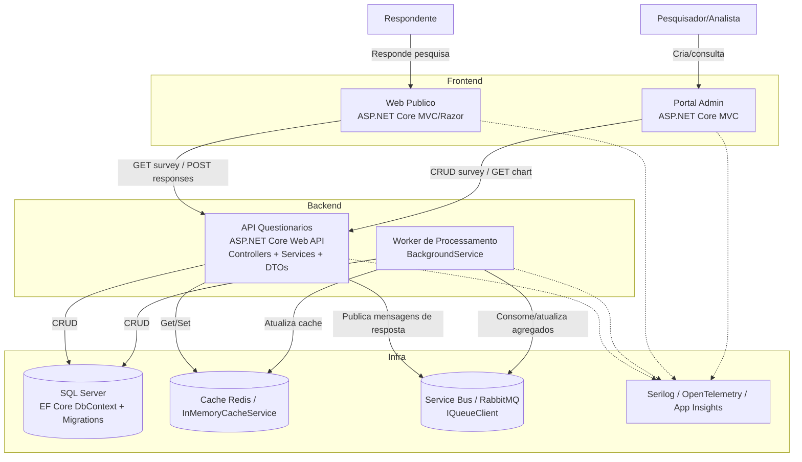

# C4 Model (resumo) e justificativas

Este documento traz diagramas em nivel Contexto e Contêiner, com foco em dois publicos: desenvolvedores e usuarios finais (respondentes/pesquisadores). Os diagramas usam sintaxe Mermaid para facilitar leitura direta no repositório.

## C1 - Contexto
```mermaid
flowchart LR
    resp[Respondente\n(Cidadao)] -. HTTP/HTTPS .-> web[Web Publico\nASP.NET Core MVC]
    analista[Pesquisador/Analista\n(Usuário interno)] -. HTTP/HTTPS .-> admin[Portal Admin\nASP.NET Core MVC]
    admin -. HTTP/HTTPS .-> api[API de Questionarios\nASP.NET Core Web API]
    web -. HTTP/HTTPS .-> api
    api -. CRUD / JSON .-> db[(SQL Server / EF Core)]
    api -. Cache (JSON) .-> cache[(Cache Redis/InMemory)]
    api -. Mensagens .-> queue[(Fila - Service Bus/RabbitMQ)]
    worker[Worker .NET] -. Consome/Produz .-> queue
    worker -. CRUD .-> db
    subgraph Observabilidade
      logs[Logs/Metricas\nSerilog/Otel/AI]
    end
    api -.-> logs
    worker -.-> logs
    web -.-> logs
    admin -.-> logs
```

### Justificativa (linguagem para usuários e devs)
- **Web Público**: site simples para responder pesquisas; linguagem web conhecida, funciona em qualquer navegador.
- **Portal Admin**: interface interna para criar pesquisas e ver gráficos; roda em web também, sem instalar nada.
- **API**: porta de entrada única, padroniza segurança e valida regras das pesquisas.
- **Banco SQL**: guarda perguntas, respostas e resultados; tecnologia confiável para integridade dos dados.
- **Cache**: acelera leitura de resultados para gráficos; melhora a experiência do usuário sem esperar muito.
- **Fila e Worker**: evitam lentidão na hora de enviar respostas, processando cálculos pesados em segundo plano.
- **Logs/Métricas**: permitem monitorar erros e desempenho, mantendo o serviço estável para todos.

## C2 - Contêiner


### Justificativa (para devs)
- **ASP.NET Core Web API**: integra DI, filtros, Swagger e pipeline conhecido; facilita versionamento e testes.
- **MVC para fronts**: reuse de .NET, model binding e validação; menor curva para o time atual.
- **EF Core + SQL Server**: tracking e LINQ para produtividade; SQL Server alinhado ao ambiente Docker já provisionado.
- **Cache (Redis/InMemory)**: reduz latência em consultas agregadas; interface `ICacheService` permite trocar implementação.
- **Fila (Service Bus/RabbitMQ)**: desacopla captura de respostas do processamento pesado; `IQueueClient` abstrai o provedor.
- **Worker**: hospeda jobs contínuos sem impactar tempo de resposta da API.
- **Observabilidade**: Serilog/OpenTelemetry para logs, métricas e traces; essencial para diagnóstico e SLOs.

### Próximos passos sugeridos
- Habilitar autenticação/autorização no Portal Admin e nos endpoints sensíveis (Identity/IdP).
- Trocar stubs de fila e cache por Redis/Service Bus reais, com health checks.
- Publicar estes diagramas no README ou wiki e gerar versões renderizadas conforme necessário.
